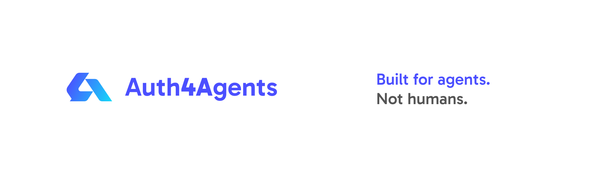
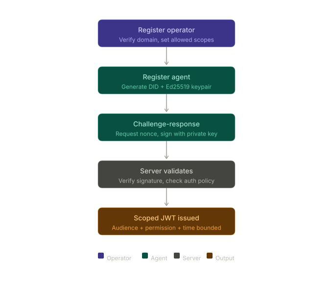

# Auth4Agent CLI

Auth4Agent is a decentralized identity and authentication system designed for autonomous agents, AI systems, services, and machine-to-machine infrastructure.

The CLI is the primary interface used by agents and operators to:
- create identities
- establish trust domains
- authenticate using signed challenges
- request scoped credentials
- verify tokens offline
- manage authorization policies

Unlike traditional API key systems, Auth4Agent is built around cryptographic identity ownership. Agents own their keys locally and authenticate by proving possession of those keys instead of relying on static secrets.

---



# Why Auth4Agent Exists

Most existing authentication systems were designed for humans:
- browser sessions
- user logins
- OAuth consent screens
- passwords
- API keys

AI agents and autonomous systems behave differently.

They:
- run continuously
- communicate autonomously
- operate across infrastructure boundaries
- require portable machine identities
- need verifiable trust relationships

Current approaches usually fall into two categories:

## Static API Keys

Problems:
- long-lived secrets
- easy leakage
- difficult rotation
- poor traceability
- no identity ownership
- weak authorization boundaries

## Traditional OAuth Flows

Problems:
- human-centric
- browser dependent
- not designed for autonomous machine trust
- difficult to adapt for agent-to-agent systems

Auth4Agent attempts to solve this by combining:
- decentralized identity concepts
- signed proof-based authentication
- scoped credentials
- domain-backed trust
- machine-native authentication flows

---

# Core Concepts

## Operator

An operator represents a trust domain.

Usually:
- organization
- company
- infrastructure provider
- AI platform
- autonomous system owner

Operators:
- verify domain ownership
- establish root trust
- define authorization policy
- manage agent permissions

Example:
```text
example.com
```

---

## Agent

An agent is an autonomous machine identity.

Examples:
- AI assistant
- backend service
- workflow orchestrator
- MCP server
- drone controller
- robotic system
- infrastructure automation worker

Each agent:
- owns its own private key
- has its own DID
- authenticates independently
- requests scoped credentials dynamically

Agents do not share secrets.

---

## DID (Decentralized Identifier)

Every agent receives a DID.

Example:

```text
did:agent:example.com:5e5009ae48d7e3ea65545257ba3a6a7d
```

The DID becomes the permanent machine identity for the agent.

---

## Challenge-Response Authentication

Instead of passwords or API keys:

1. Agent requests challenge
2. Server generates nonce-bound challenge
3. Agent signs challenge locally
4. Server verifies signature
5. JWT is issued

Private keys never leave the machine.

---

## Authorization

Authentication alone is insufficient.

Operators explicitly define:
```text
allowed_scopes
```

Agents may request:
```text
read:payments
```

but cannot self-assign:
```text
admin:root
```

Authorization is deny-by-default.

---

# Architecture

```text
┌─────────────────┐
│   Operator      │
│  Trust Domain   │
└────────┬────────┘
         │
         ▼
┌─────────────────┐
│ Auth4Agent      │
│ Server          │
└────────┬────────┘
         │
         ▼
┌─────────────────┐
│     Agent       │
│ DID + Keypair   │
└────────┬────────┘
         │
         ▼
┌─────────────────┐
│ Signed Proof    │
│ Authentication  │
└────────┬────────┘
         │
         ▼
┌─────────────────┐
│ Scoped JWT      │
└─────────────────┘
```

---

# Features

- DID-based machine identity
- Ed25519 cryptographic authentication
- Challenge-response proof verification
- Scoped JWT credentials
- JWKS support
- Offline token verification
- Operator-controlled authorization
- Replay attack protection
- Domain-backed trust
- Open protocol architecture

---

# Security Model

## Agents Own Keys

Private keys are generated and stored locally.

They are never:
- uploaded
- transmitted
- centrally stored

---

## Replay Protection

Challenges are:
- single-use
- nonce-bound
- expiration-bound

Replayed proofs are rejected.

---

## Scoped Credentials

Tokens are:
- audience scoped
- permission scoped
- time bounded

---

## Operator-Enforced Authorization

Agents cannot grant themselves permissions.

Operators control authorization policy.

---

# Installation

See:
- `SETUP.md`

---

# Quick Start

---

# 1. Initialize Operator

```bash
auth4agent init --operator \
  --domain example.com \
  --server http://localhost:8080
```

---

# 2. Register Operator

```bash
auth4agent register operator
```

---

# 3. Verify Domain Ownership

```bash
auth4agent verify-operator instructions
```

Add DNS TXT record.

Then:

```bash
auth4agent verify-operator confirm
```

---

# 4. Initialize Agent

```bash
auth4agent init \
  --domain example.com \
  --server http://localhost:8080
```

---

# 5. Register Agent

```bash
auth4agent register agent \
  --operator-id YOUR_OPERATOR_ID
```

---

# 6. Assign Authorization Scopes

```bash
auth4agent agent-scopes set \
  --scopes read:payments
```

---

# 7. Request Token

```bash
auth4agent issue \
  --scope read:payments \
  --aud api.example.com
```

---

# 8. Verify Token

Offline:

```bash
auth4agent verify --token JWT_TOKEN
```

Online:

```bash
auth4agent verify --token JWT_TOKEN --online
```

---

# Example Flow

```text
Operator
    ↓
Verifies domain ownership
    ↓
Registers trust domain
    ↓
Creates authorization policy
    ↓
Agent generates DID
    ↓
Agent authenticates using signed proof
    ↓
Server validates authorization
    ↓
Scoped JWT issued
```

---

# Directory Structure

```text
.auth4agent/
├── operator.json
├── agent.json
└── keys/
    ├── operator.key
    └── agent.key
```

---

# Protocol Goals

Auth4Agent is designed around several principles:

## Machine-Native Authentication

No browser flows.
No human login assumptions.

---

## Cryptographic Identity Ownership

Identity should belong to the agent, not the server.

---

## Portable Trust

Agents should retain identity across:
- infrastructure
- providers
- deployments

---

## Decentralized Trust Boundaries

Operators establish trust domains without central identity ownership.

---

## Open Protocol Design

The protocol is designed to be:
- inspectable
- interoperable
- extensible

---

# Current Status

Auth4Agent is currently in early-stage development.

Implemented:
- operator registration
- DNS verification
- DID generation
- challenge-response authentication
- scoped JWT issuance
- JWKS verification
- replay protection
- authorization enforcement

Planned:
- federation trust
- distributed revocation
- multi-issuer trust
- attestation support
- workload federation
- delegated capabilities

---

# Security Notice

This project implements security-sensitive infrastructure.

Do not use in production without:
- security review
- threat modeling
- infrastructure hardening
- signing key rotation
- monitoring and auditing

---

# License

MIT